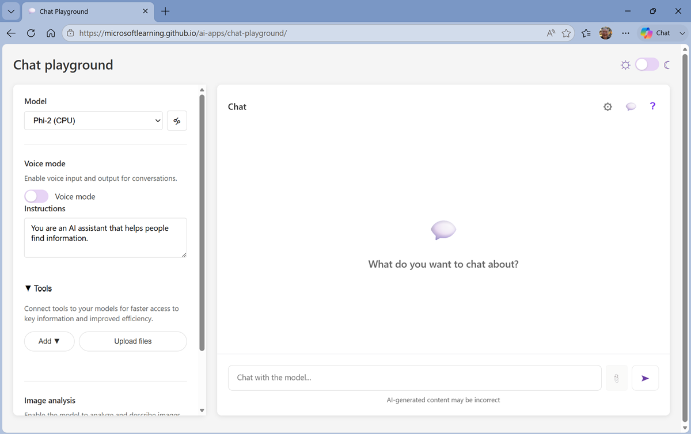
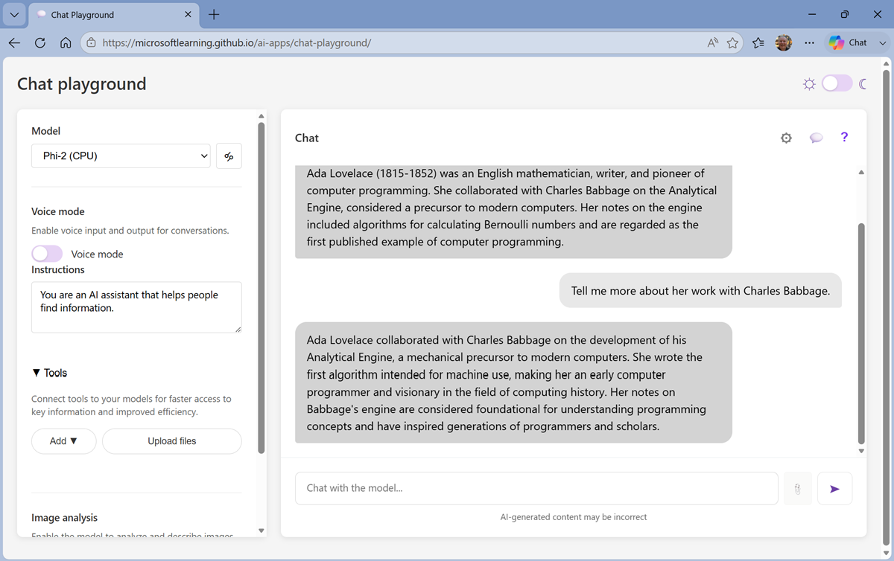
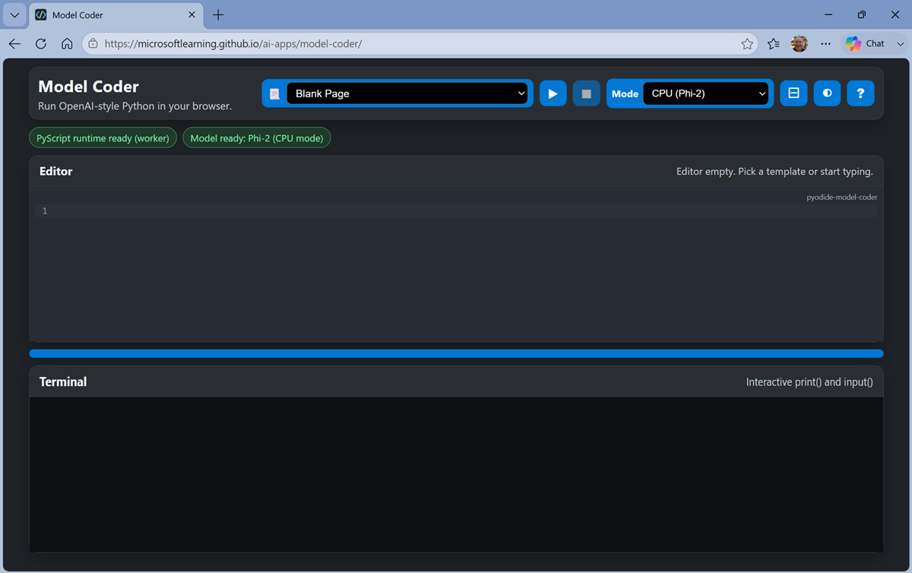
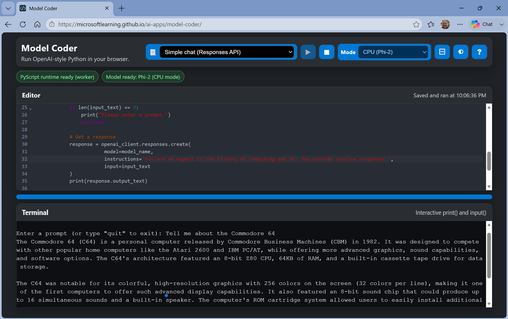
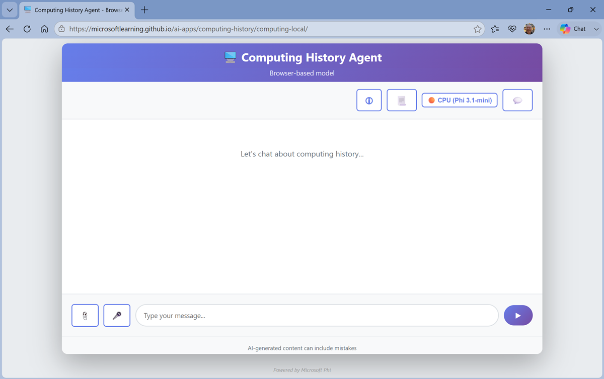
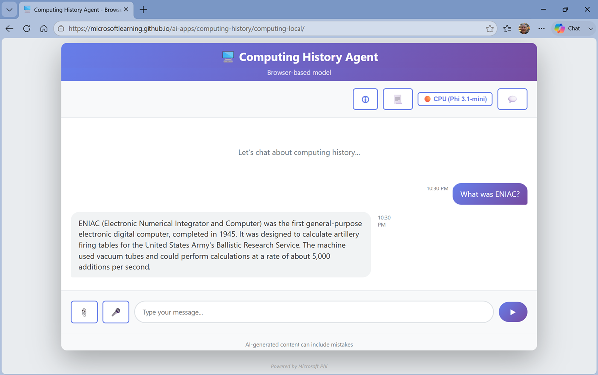

---
lab:
  title: Fallback alternative lab - Explore agent concepts
  description: No cloud subscription? Explore key agent development concepts in your browser.
  level: 100
  duration: 30 minutes
  islab: true
---

# Explore agent concepts

If you don't have access to an Azure subscription, but you want to get hands-on with some key elements of agent development; this exercise is for you!

In this exercise, you'll use real large language models that run locally in your browser to explore how AI agents work and can be used to power intelligent solutions.

To complete this exercise, you need a modern browser on a computer with sufficient hardware resources to load and run the models. On older or low-spec computers, the apps may run very slowly or experience errors.

> **Minimum recommended spec**<br>
>
> - 64-bit CPU, 4+ physical cores (8 logical threads preferred)
> - GPU required for the default Phi 3.5-mini model.
> - 8+ GB system RAM (16 GB recommended)
> - Enough storage to cache ~300MB–800MB model assets
> - Latest Chrome / Edge / Firefox with WASM SIMD enabled/available (WebGPU support is required for the default model; a WASM-based fallback is provided)

If your computer does not meet these requirements, the AI models may not run successfully. However, the apps do support a failsafe "Basic" mode in which no model is used; which you may be able to use.

This exercise should take approximately **30** minutes to complete.

## Chat with a model

Let's start by using a chat interface to submit prompts to a generative AI model. In this exercise, we'll use a small language model that is useful for general chat solutions in low bandwidth scenarios.

To cha with the model, we'll use an interactive *chat playground* that provides a similar interface to the Microsoft Foundry portal.

> **Note**: If your browser supports WebGPU, the chat playground uses the *Microsoft Phi 3.5 Mini* model running on your computer's GPU. If not, the *Microsoft Phi 2* model is used, running on CPU - with reduced response-generation quality. Performance for either model may vary depending on the available memory in your computer and your network bandwidth to download the model. On older or low-spec devices, you may get more reliable behavior by switching to the *None* model even if CPU or GPU is available. After opening the app, use the **?** (*About this app*) icon in the chat area to find out more.

1. In a web browser, open the **[Chat Playground](https://aka.ms/chat-playground){:target="_blank"}** at `https://aka.ms/chat-playground`.
1. Wait for the model to download and initialize.

    > **Tip**: The first time you download a model, it may take a few minutes. Subsequent downloads will be faster. If your browser or operating system does not support WebGPU models, the fallback CPU-based model will be selected (which provides slower performance and reduced quality of response generations). If *that* fails, the basic mode in which responses are retrieved from Wikipedia is used.

1. When the model is ready, review the playground interface, which should look similar to this.

    

    > **Tip**: You can switch between *light* and *dark* themes using the &#x263C; / &#x263E; toggle at the top right.

1. In the **Chat** pane, enter a prompt such as `Who was Ada Lovelace?`, and review the response.

    > **Note**: Depending on the spec of your computer, and the model/mode selected in the app, the response may some time to be returned.

1. Enter a follow-up prompt, such as `Tell me more about her work with Charles Babbage.` and review the response.

    

    >**Note**: Generative AI chat applications often include the conversation history in the prompt; so the context of the conversation is retained between messages. In this case, "her" is interpreted as referring to Ada Lovelace.

1. At the top-right of the chat pane, use the **New chat** (💬) button to restart the conversation. This removes all conversation history.
1. Enter a new prompt, such as `Tell me about the ELIZA chatbot.` and view the response.
1. Continue the conversation with prompts such as `How does it compare with modern LLMs?`.

## Specify instructions in a *system prompt*

To support specific use cases, you should use a *system prompt* to provide the model with instructions that guide its responses. You can use the system prompt to give the model a specific focus or role, and provide guidelines about format, style, and constraints about what the model should and should not include in its responses.

1. In the model playground, at the top-right of the chat pane, use the **New chat** button to restart the conversation and remove the conversation history.
1. In the pane on the left, in the **Instructions** text area, change the system prompt to:

    ```
   You are an expert in the history of computing and AI. You provide concise responses.
    ```

1. Now enter a new user prompt related to computing history, such as `What was Alan Turing's contribution to the development of AI?`

    Review the response, which should provide some relevant information.

## Add a web_search tool

So far, the model has answered questions based on the data with which it was trained. While this is useful, that leaves out a lot of current information on the web; which might help the model give more relevant answers.

We can use *tools* to give models access to external data sources, and to perform custom tasks. Let's add a tool that enables the model to search the Web for up-to-date information.

1. In the pane on the left, under the instructions, expand the **Tools** section if it is not already expanded.
1. In the **Add** drop-down list, select **Web search**.
1. After adding the *web search* tool, in the chat pane, enter the prompt `Find a vintage computer store near Seattle` (*or your local city!*) and review the response.

    The model should have searched the Web for vintage computer stores near the specific city.

## Explore client code

You've seen how a model can be used in a pre-provided chat playground, but how do developers build apps and agents that submit prompts to models and process responses?

One of the most commonly used application programming interfaces (APIs) used to develop apps that work with LLMs is the OpenAI API - and in particular the Python SDK for the OpenAI API.

1. Navigate away from the Chat Playground app to the **[Model Coder](https://aka.ms/model-coder){:target="_blank"}** app at `https://aka.ms/model-coder` and wait for the Python environment and model to load.

    > **Note**: As with the chat playground, the first time the model is loaded it may take a minute or so. If your browser supports WebGPU, the Microsoft Phi 3.5-mini model will be loaded using the WebLLM engine. Otherwise, the Phi 2 model will be used in wllama, running in CPU mode.

    

    > **Tip**: You can switch between *light* and *dark* themes using the &#9681; icon at the top right.

    This app provides an in-browser sandbox with a Python library that encapsulates the most common classes in the OpenAI SDK. You'll use it to write and run real Python code that submits prompts to a local LLM running in the browser.

1. When the model has loaded, select the **Simple chat (Responses API)** template, and view the code in the **Editor** pane.
1. Edit the code to change the **instructions** for the model to the same computing history related one you used in the chat playground, as shown here:

    ```python
   # import namespace
   from openai import OpenAI

   def main(): 

        try:
            # Configuration settings 
            endpoint = "https://local/openai"
            key = "key123"
            model_name = "local-llm"

            # Initialize the OpenAI client
            openai_client = OpenAI(
                base_url=endpoint,
                api_key=key
            )
            
            # Loop until the user wants to quit
            while True:
                input_text = input('\nEnter a prompt (or type "quit" to exit): ')
                if input_text.lower() == "quit":
                    print("Goodbye!")
                    break
                if len(input_text) == 0:
                    print("Please enter a prompt.")
                    continue

                # Get a response
                response = openai_client.responses.create(
                            model=model_name,
                            instructions="You are an expert in the history of computing and AI. You provide concise responses.",
                            input=input_text
                )
                print(response.output_text)
                

        except Exception as ex:
            print(ex)

   if __name__ == '__main__': 
        main()
    ```

    This code uses the OpenAI *Responses* API, which is commonly used to submit prompts to models and agents.

1. Use the **&#9654;** (Run code) button on the toolbar to run the Python code.

    The code runs in the **Terminal** pane at the bottom of the screen (it may take a minute or so to run).

1. When prompted, enter questions about computing history and view the responses.

    Some suggested prompts to try:

    - `Tell me about the Commodore 64`
    - `Who was Grace Hopper?`

    

    > **Note**: The model used in this app is a small language model with limited training data and a small context window. Responses may not be accurate. However, the point of the exercise is to explore the OpenAI SDK syntax to submit prompts and receive responses.

    When you're finished, enter `quit`.

## Use an agent

Now that you've explored the fundamental building blocks of how agent's are built from models, instructions, and tools; and how applicatio developers can write code to submit prompts to models and agents, it's time to see how all of this can come together in an agentic application.

1. Navigate away from the Model Coder app to the **[Computing History agent](https://aka.ms/computing-history-browser){:target="_blank"}** at `https://aka.ms/computing-history-browser`.

    > **Note**: The first time you download a model, it may take several minutes. Subsequent downloads will be faster.<br><br>By default, the browser-based app uses the Microsoft Phi 3.5-mini model running in WebLLM (via WebGPU). When a GPU is unavailable, the app uses a fallback mode with the Phi 3.1-mini model running in the wllama CPU-based engine. If that fails, then a **Basic** mode with no large language model is used.<br><br>If the model is taking a long time to load, you can cancel and start in Basic mode. You can switch between available modes at any time in the main application user interface.

    After loading, the application should look similar to this:

    

1. Enter a prompt, such as `What was ENIAC?` and view the response.

    

## Summary

In this exercise, you explored key elements of AI agents, including large language models, instructions, tools, and client applications.

## Next steps

If you want to learn more about the core concepts of AI and agents, check out the [AI concepts for developers and technology professionals](https://aiskillsnavigator.microsoft.com/explore/search/learningpath-64735f4d575e2684eefd5b9e24b2b9d7b4126931707290aa539166a63501f4d6){:target="_blank"} learnng path on AI Skills Navigator.

> **[Ask Anton](https://aka.ms/ask-anton){:target="_blank"}**<br/><br/>If you have questions about some of the topics covered in this exercise, *[Ask Anton](https://aka.ms/ask-anton){:target="_blank"}* is a generative AI-based agent that you can ask about AI concepts and Microsoft Foundry.<br/><br/>*Ask Anton is not a supported Microsoft product or a component of Microsoft Learn or AI Skills Navigator. Just a sample AI agent for you to explore as you learn about what's possible with AI.*<br/><br/>If you *do* check out Ask Anton, we'd love you to *[tell us about your experience](https://forms.office.com/r/fC0ndfBQeK){:target="_blank"}*!
